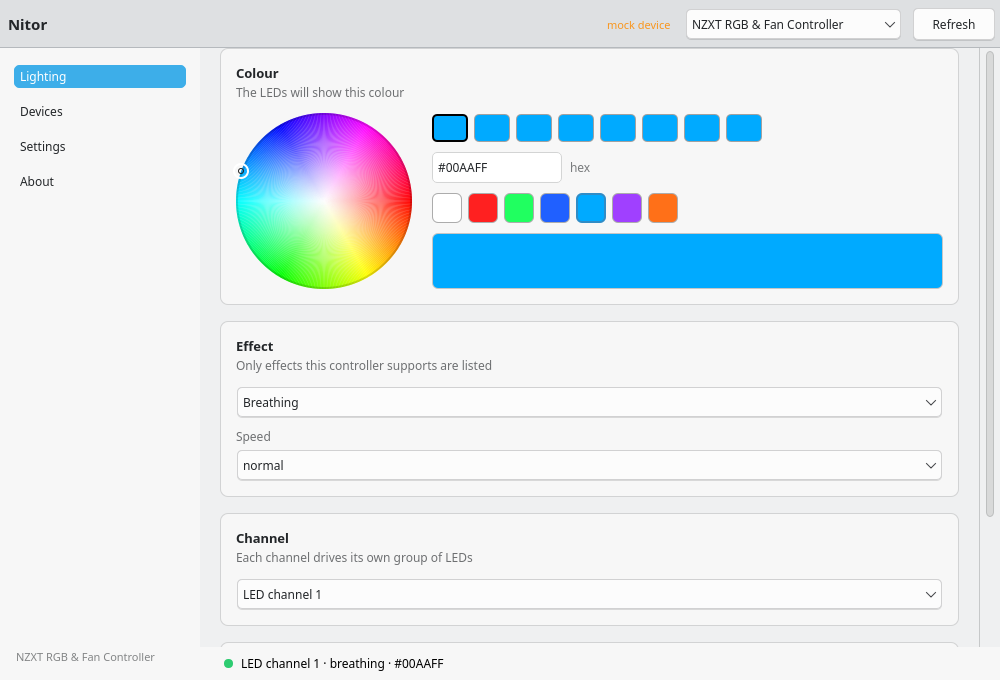

<h1 align="center">Nitor</h1>

<p align="center">
  Simple, reliable control of NZXT RGB/LED lighting on Linux — without NZXT CAM.
</p>

<p align="center">
  <em>nitor</em> — Latin: shine, brightness, brilliance.
</p>

<p align="center">
  
  
  
  
</p>



## What this is

`Nitor` is a small, native Linux desktop application for controlling **NZXT LED lighting** and
nothing else. It detects supported controllers, shows what the hardware can actually do, and lets you
set a colour, an effect and a channel. That is the whole program.

It is built for CachyOS / Arch with KDE Plasma on Wayland, and it uses the system theme: Qt Quick
Controls picks up the Plasma style, so light/dark appearance and accent colours come from the desktop
rather than from a hardcoded palette. There is no embedded web page, no vendor account and no
background daemon.

## What this is not

`Nitor` is not NZXT CAM for Linux, not an OpenRGB replacement, not a monitoring suite and not a fan
controller. It deliberately does **not** touch:

pump speed · pump curves · fan speed · fan curves · cooling modes · thermal thresholds · firmware ·
the Kraken LCD · motherboard, GPU or RAM RGB · keyboards · mice · other vendors' lighting ·
overclocking · telemetry · accounts · cloud services

That boundary is enforced in code, not just documented. Every command is built and checked in
[`src/nitor/backend/commands.py`](src/nitor/backend/commands.py) before any process is started, and
[`tests/test_safety_allowlist.py`](tests/test_safety_allowlist.py) attacks the check with fan, pump,
firmware and LCD commands that must all be refused.

## Project status

Version 0.1.0, in development, **not yet verified on physical hardware**. Here is the honest state of
things:

| Area | State |
| :--- | :--- |
| Device detection, capability model, effect tables | Implemented, read from the upstream liquidctl drivers, covered by tests |
| Interface, settings, diagnostics, startup service | Implemented; exercised in CI against the mock backend |
| Changing a real LED's colour | **Not yet tested.** The development machine does not have `liquidctl` and its udev rules installed yet, so unprivileged HID access is not available |
| Effects on real LEDs, persistence across a power cycle | Not yet tested |

The tested/untested table in [`docs/hardware-notes.md`](docs/hardware-notes.md) is updated as soon as
the hardware steps in this repository's own checklist are completed. Nothing is described as tested
before it has been observed.

## Hardware support

| Device | USB ID | Lighting channels | Effect set |
| :--- | :--- | :--- | :--- |
| NZXT RGB & Fan Controller | `1e71:2010` | `led1`, `led2`, `sync` | HUE 2 generation (27 effects) |
| NZXT Kraken Z53 / Z63 / Z73 | `1e71:3008` | `external` (HUE 2 chain) | liquid cooler set (30 effects) |

Additional models that liquidctl can already drive lighting for are described in
[`src/nitor/domain/profiles.py`](src/nitor/domain/profiles.py), including a few that liquidctl supports
for fan control while its lighting protocol is still unimplemented upstream — Nitor says so for those
instead of showing controls that would do nothing.

On a **Kraken Z**, the pump face is an LCD rather than an RGB ring, so the only controllable LEDs are
the ones on the `external` HUE 2 header. The LCD is out of scope.

## Installation (CachyOS / Arch)

`Nitor` talks to the hardware through [`liquidctl`](https://github.com/liquidctl/liquidctl), which
provides the safe, documented protocol support and the udev rules that allow unprivileged access:

```bash
sudo pacman -S liquidctl
```

There is no tagged release yet, so install from trunk:

```bash
git clone https://github.com/crizzler/nitor
cd nitor/packaging/arch/nitor-git
makepkg -si
```

That installs `nitor-git` along with the desktop entry, AppStream metadata, hicolor icons and a
ready-to-use `systemd --user` unit. Once a release is tagged, `packaging/arch/nitor/PKGBUILD`
builds the versioned package; see [`docs/packaging.md`](docs/packaging.md), which also documents a
virtualenv install for machines whose PKGBUILD scanner refuses an unverifiable package. Nitor is
**not** on the AUR.

### Running from a source checkout

```bash
git clone https://github.com/crizzler/nitor
cd nitor
PYTHONPATH=src python -m nitor
```

There is a development mode that never touches hardware, for working on the interface anywhere:

```bash
PYTHONPATH=src python -m nitor --mock-device
```

## Using it

1. Launch `Nitor` from the application launcher.
2. A compatible controller is selected automatically, if one is connected.
3. Pick a channel, an effect and a colour. Changes apply as you go.

Only effects and channels the selected controller actually supports are offered, and the number of
colour slots follows the chosen effect — `fixed` takes one colour, `fading` up to eight, the rainbow
modes take none. If nothing is detected on a channel, Nitor says so rather than pretending to control
it.

### About brightness

The HUE 2 protocol and the Kraken drivers expose **no brightness setting** for these LED channels, so
the brightness control dims the colour Nitor sends. The interface says that plainly and shows the
colour that will actually be transmitted, rather than implying a hardware register exists.

### Going easy on the controller

Dragging a colour wheel produces hundreds of states a second, and every write costs a liquidctl
process plus a USB transaction. Writes are therefore debounced, coalesced to the newest state, limited
to one in flight at a time, and spaced out; **Apply now** skips the wait. The policy lives in
[`src/nitor/services/scheduling.py`](src/nitor/services/scheduling.py) and is tested with a fake
clock.

## Startup restoration

Lighting can be reapplied at login without leaving the window open. Enable *Apply my lighting settings
when I log in* in Settings and Nitor installs and enables a `systemd --user` service:

```bash
systemctl --user status nitor.service
```

It is a one-shot unit: it applies the saved lighting and exits. No root daemon, nothing resident, no
`sudo` ever run on your behalf.

## Troubleshooting

Start with [`docs/troubleshooting.md`](docs/troubleshooting.md): it covers the four things that
actually go wrong — the backend is not installed, the udev rule is missing, nothing is detected, or
something else is holding the device open.

**Settings → Copy diagnostics** produces a report with versions, detected USB IDs, channels and
permission state. It contains no user names, host names, home directories or serial numbers, so it is
safe to paste into an issue along with:

```bash
lsusb | grep -iE "NZXT|1e71"
liquidctl list
```

## Development

```bash
git clone https://github.com/crizzler/nitor
cd nitor

# Tests: no hardware, no display, no root
PYTHONPATH=src pytest

# Lint and formatting
ruff check . && ruff format --check .

# QML (Qt 6's linter, warnings treated as errors)
find src -name '*.qml' -exec qmllint -W0 {} \;

# The whole application, headless: backend, command gate, settings, unit, QML
PYTHONPATH=src python -m nitor --backend mock --self-test
```

Useful flags: `--verbose` for debug logging, `--backend mock|liquidctl|auto` to force a backend,
`--apply-saved` for the login path, `--diagnostics` to print the report.

The architecture keeps three layers apart:

```
src/nitor/
├── domain/     pure logic: colours, effects, capabilities. No Qt, no I/O
├── backend/    the hardware contract, the liquidctl backend, the mock backend, the safety gate
├── services/   settings, write scheduling, diagnostics, startup restoration
└── ui/         the QML interface and the view model that exposes the rest to it
```

Everything except the backend is testable without a controller plugged in, and the interface never
waits for hardware: hardware work runs on a worker thread. See
[`docs/development-notes.md`](docs/development-notes.md) for the decisions behind all of this and
[`CONTRIBUTING.md`](CONTRIBUTING.md) if you would like to help.

## License

MIT — see [`LICENSE`](LICENSE).

## Non-affiliation

This project is **not affiliated with, endorsed by or supported by NZXT**. NZXT, Kraken and HUE are
trademarks of their respective owners and are used here only to describe hardware compatibility.

Nitor drives the hardware through [`liquidctl`](https://github.com/liquidctl/liquidctl), which is
licensed GPL-3.0-or-later and is run as a separate program rather than linked into this MIT-licensed
code.
